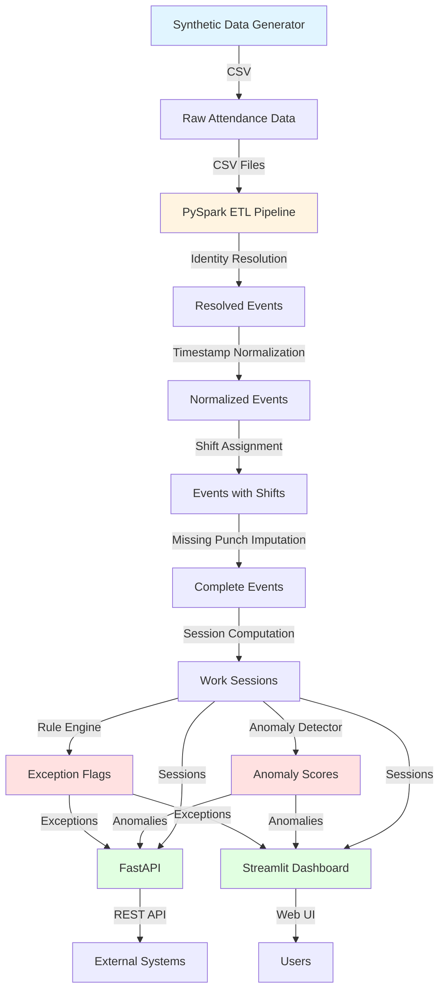

# Architecture Diagram

## Data Flow Architecture

## Component Description

### 1. Data Generation Layer
- **Synthetic Data Generator**: Creates realistic attendance events with edge cases
- Outputs: `attendance.csv`, `employees.csv`, `shifts.csv`, `shift_swaps.csv`

### 2. ETL Layer (PySpark)
- **Identity Resolution**: Maps badges/phone IDs to employees
- **Timestamp Normalization**: Handles timezones and DST
- **Shift Assignment**: Assigns events to shifts (handles night shifts)
- **Missing Punch Imputation**: Fills in missing check-outs
- **Session Computation**: Creates work sessions from events
- Outputs: `work_sessions.csv`

### 3. Analytics Layer
- **Exception Engine**: Rule-based exception detection
  - Late check-in, early check-out
  - Missed punches
  - Mid-shift registration
  - Night shift crossing
  - Excessive overtime
- **Anomaly Detector**: ML-based anomaly detection (IsolationForest)
  - Feature extraction
  - Anomaly scoring
  - Explanation generation

### 4. API Layer (FastAPI)
- **Endpoints**:
  - `GET /employee/{id}/work_sessions`: Employee history
  - `POST /ingest`: Ingest events
  - `GET /alerts`: Exception/anomaly alerts

### 5. Dashboard Layer (Streamlit)
- **Visualizations**:
  - Workforce heatmap (hourly, per facility)
  - Exception timeline
  - Employee drill-down
  - Event timeline replay

## Data Storage

- **Raw Data**: CSV files in `data/raw/`
- **Processed Data**: CSV files in `data/processed/`
- **Optional**: PostgreSQL (via Docker) for production persistence

## Deployment

- **Local Development**: Run components independently
- **Docker Compose**: Optional PostgreSQL and Kafka services
- **Production**: Deploy Spark on cluster, use distributed storage

